# Database Schema

60 tables across auth, catalogue, commerce, services, the Growth Agent, content, and developer tooling. Full column definitions live in `database/migrations/` (one file per table, each with an `up()`/`down()` — that's the authoritative source; this document is the map).

## Core relationships (ERD)

The diagram below covers the tables that carry the primary relationships — commerce, catalogue, services, and the Growth Agent's core loop. Supporting/lookup tables are listed by domain further down.

```mermaid
erDiagram
    ROLES ||--o{ USERS : "has"
    ROLES ||--o{ ROLE_PERMISSION : "grants"
    PERMISSIONS ||--o{ ROLE_PERMISSION : "granted via"
    USERS ||--o{ ADDRESSES : "saves"
    USERS ||--o{ PETS : "owns"
    USERS ||--o{ ORDERS : "places"
    USERS ||--o{ CARTS : "has"
    USERS ||--o{ APPOINTMENTS : "books"
    USERS ||--o{ SUBSCRIPTIONS : "starts"
    USERS ||--o{ REVIEWS : "writes"
    USERS ||--o{ WISHLISTS : "saves to"
    USERS ||--o| CUSTOMER_SCORES : "scored as"
    USERS ||--o{ LOYALTY_POINTS : "earns/redeems"
    USERS ||--o{ REFERRALS : "refers"

    CATEGORIES ||--o{ CATEGORIES : "parent of"
    CATEGORIES ||--o{ PRODUCTS : "contains"
    BRANDS ||--o{ PRODUCTS : "makes"
    PRODUCTS ||--o{ PRODUCT_VARIANTS : "has"
    PRODUCTS ||--o{ PRODUCT_IMAGES : "has"
    PRODUCTS ||--o{ REVIEWS : "reviewed on"
    PRODUCT_VARIANTS ||--o{ CART_ITEMS : "added as"
    PRODUCT_VARIANTS ||--o{ ORDER_ITEMS : "sold as"
    PRODUCT_VARIANTS ||--o{ INVENTORY_MOVEMENTS : "adjusted via"

    CARTS ||--o{ CART_ITEMS : "contains"
    CARTS }o--o| COUPONS : "may apply"

    ORDERS ||--o{ ORDER_ITEMS : "contains"
    ORDERS ||--o{ ORDER_STATUS_HISTORY : "logs"
    ORDERS ||--o{ PAYMENTS : "paid via"
    ORDERS ||--o{ REFUNDS : "refunded via"
    ORDERS ||--o{ SHIPMENTS : "shipped via"
    ORDERS }o--o| COUPONS : "redeems"
    COUPONS ||--o{ COUPON_REDEMPTIONS : "tracked in"

    SERVICES ||--o{ SERVICE_STAFF : "staffed by"
    STAFF_MEMBERS ||--o{ SERVICE_STAFF : "provides"
    SERVICES ||--o{ SERVICE_SLOTS : "scheduled as"
    STAFF_MEMBERS ||--o{ SERVICE_SLOTS : "works"
    SERVICE_SLOTS ||--o| APPOINTMENTS : "booked as"
    PETS ||--o{ APPOINTMENTS : "brought to"

    PRODUCTS ||--o{ SUBSCRIPTIONS : "subscribed to"
    PRODUCT_VARIANTS ||--o{ SUBSCRIPTIONS : "recurring as"

    SEGMENTS ||--o{ SEGMENT_MEMBERS : "includes"
    USERS ||--o{ SEGMENT_MEMBERS : "belongs to"
    SEGMENTS ||--o{ CAMPAIGNS : "targeted by"
    CAMPAIGNS ||--o{ CAMPAIGN_RECIPIENTS : "sent to"
    USERS ||--o{ CAMPAIGN_RECIPIENTS : "receives"
    ORDERS ||--o{ CAMPAIGN_RECIPIENTS : "attributed conversion"

    USERS {
        int id PK
        int role_id FK
        string email
        string password_hash
        string referral_code
    }
    PRODUCTS {
        int id PK
        int category_id FK
        int brand_id FK
        string name
        string status
        int feeding_grams_per_day
    }
    PRODUCT_VARIANTS {
        int id PK
        int product_id FK
        string sku
        int price_paise
        int stock_quantity
    }
    ORDERS {
        int id PK
        int user_id FK
        string order_number
        string status
        int total_paise
    }
    ORDER_ITEMS {
        int id PK
        int order_id FK
        int variant_id FK
        int quantity
        int line_total_paise
    }
    APPOINTMENTS {
        int id PK
        int service_id FK
        int staff_id FK
        int slot_id FK
        int user_id FK
        int pet_id FK
        string status
    }
    CUSTOMER_SCORES {
        int user_id FK
        int rfm_total
        string churn_risk
        date predicted_next_order_date
    }
    CAMPAIGNS {
        int id PK
        int segment_id FK
        string channel
        string status
    }
```

## Table reference by domain

### Auth & access
`users`, `roles`, `permissions`, `role_permission`, `sessions` (active-session tracking for remote logout), `password_resets`, `activity_logs`, `api_tokens`

### Customers
`addresses`, `pets`, `wishlists`, `enquiries` (contact form submissions)

### Catalogue
`categories` (self-referencing, nested), `brands`, `products`, `product_variants`, `product_images`, `reviews`

### Cart & commerce
`carts`, `cart_items`, `coupons`, `coupon_redemptions`, `orders`, `order_items`, `order_status_history`, `payments`, `refunds`, `shipments`, `inventory_movements`

### Services & subscriptions
`staff_members`, `staff_blackout_dates`, `services`, `service_staff`, `service_slots`, `appointments`, `subscriptions`

### Growth Agent
`customer_scores`, `segments`, `segment_members`, `campaigns`, `campaign_recipients`, `loyalty_points`, `referrals`, `notifications`, `growth_actions` (plain-English action log), `cron_runs`

### Content & settings
`pages`, `blog_categories`, `blog_posts`, `blog_comments`, `faqs`, `testimonials`, `banners`, `newsletter_subscribers`, `settings`, `mail_logs`

### Developer tools
`slow_queries`, `webhook_deliveries`, `feature_flags`, `migrations` (tracks which migration files have run)

## Conventions

- Money is always stored as **integer paise** (`_paise` suffix), never floats — avoids rounding drift.
- `created_at`/`updated_at` on every table where a row can meaningfully be edited after creation; omitted (via `$timestamps = false` on the model) where a table is purely an append-only log.
- Soft deletes (`deleted_at`) on tables where losing history would hurt: `users`, `products`, `product_variants`, `orders`, `addresses`, `pets`.
- Every foreign key has an explicit `ON DELETE` policy — `CASCADE` for true ownership (delete a cart, its items go), `SET NULL` where the parent is optional context (delete a brand, its products just lose the brand label).
